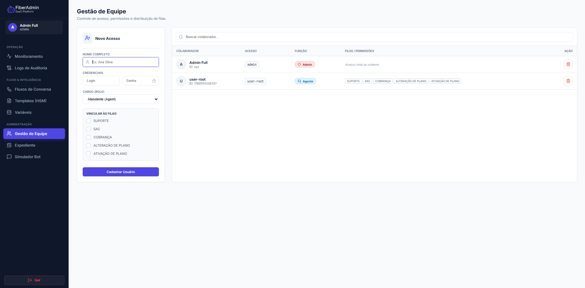

# FiberAdmin Chatbot Platform

[](https://react.dev/)
[](https://vitejs.dev/)
[](https://expressjs.com/)
[](https://nodejs.org/)
[](https://opensource.org/licenses/MIT)

Uma plataforma completa de **orquestração de chatbots** com interface visual de fluxos, autenticação baseada em papéis (RBAC), e integração com sistemas ERP para atendimento automatizado ao cliente.



## ✨ Funcionalidades Principais

### 🤖 Editor Visual de Fluxos
- Interface drag-and-drop construída com **ReactFlow**
- 15 tipos de nós especializados:
  - **Nós de Mensagem**: Envio de mensagens de texto e templates
  - **Nós de Input**: Captura de dados do cliente (CPF, etc.)
  - **Nós de Script**: Execução de JavaScript customizado
  - **Nós de Condição**: Lógica condicional com múltiplas regras
  - **Nós de HTTP**: Integração com APIs externas (ERP)
  - **Nós de Âncora e GOTO**: Organização de fluxos complexos
  - **Nós de Fila**: Encaminhamento para agentes humanos
  - **Nós de Template**: Botões interativos para WhatsApp
  - **Nós de Delay**: Pausas temporizadas
  - **Nós de Agendamento**: Verificação de horário comercial

### 👥 Sistema de Filas e Agentes
- **RBAC (Role-Based Access Control)**: Admin, Manager, e Agent
- Sistema de filas configuráveis (SUPORTE, COBRANÇA, SAC, ATIVAÇÃO)
- Workspace de agentes com interface em tempo real
- Transferência de chats entre agentes
- Histórico completo de atendimentos

### 📊 Dashboard de Monitoramento
- Visualização de agentes online/offline (heartbeat a cada 15s)
- Chats ativos e em espera
- Métricas de desempenho
- Logs de sistema integrados

### 🔧 Gestão Administrativa
- Gerenciamento de usuários e permissões
- Templates de mensagens reutilizáveis
- Variáveis globais do sistema
- Agendamentos e horários comerciais
- Simulador de chat para testes

## 🛠️ Stack Tecnológico

### Frontend
- **React 19** - Framework UI moderno com hooks
- **Vite 7** - Build tool ultrarrápido
- **ReactFlow** - Biblioteca para diagramas interativos
- **React Router DOM** - Navegação SPA
- **Lucide React** - Ícones modernos

### Backend
- **Express 5** - Framework web minimalista
- **CORS** - Configuração de política de origem cruzada
- **File-based Database** - Persistência em JSON para simplicidade
- **JWT-style Auth** - Autenticação baseada em tokens customizados

### Arquitetura
```
┌─────────────────┐     ┌─────────────────┐     ┌─────────────────┐
│   React Client  │────▶│  Express API    │────▶│   JSON Database │
│   (Vite + ES6)  │◀────│   (Node.js)     │◀────│   (db.json)     │
└─────────────────┘     └─────────────────┘     └─────────────────┘
        │
        ▼
┌─────────────────┐
│  ERP Simulator  │
│ (customers API) │
└─────────────────┘
```

## 🚀 Getting Started

### Pré-requisitos
- Node.js 18+ (recomendado: 20 LTS)
- npm ou yarn
- Git

### Instalação

1. **Clone o repositório**
```bash
git clone https://github.com/seu-usuario/fiberadmin-chatbot.git
cd fiberadmin-chatbot
```

2. **Configure as variáveis de ambiente**
```bash
# Backend
cd server
cp .env.example .env
# Edite .env conforme necessário

# Frontend
cd ../client
cp .env.example .env
# Edite .env conforme necessário
```

3. **Instale as dependências**
```bash
# Backend
cd server
npm install

# Frontend (novo terminal)
cd client
npm install
```

4. **Inicie o servidor**
```bash
cd server
npm run dev
# Servidor rodando em http://localhost:3001
```

5. **Inicie o cliente**
```bash
cd client
npm run dev
# Aplicação em http://localhost:5173
```

### Credenciais Padrão
- **Usuário**: admin
- **Senha**: 123

⚠️ **Importante**: Altere as credenciais padrão em produção!

## 📁 Estrutura do Projeto

```
fiberadmin-chatbot/
├── server/                    # Backend Express
│   ├── index.js              # Ponto de entrada da API
│   ├── db.json               # Banco de dados local
│   ├── .env                  # Variáveis de ambiente
│   └── package.json
│
├── client/                    # Frontend React
│   ├── src/
│   │   ├── App.jsx           # Componente raiz
│   │   ├── main.jsx          # Entry point
│   │   ├── context/          # Contextos React
│   │   ├── nodes/            # Componentes de nós ReactFlow
│   │   ├── pages/            # Páginas da aplicação
│   │   └── services/         # API clients
│   ├── index.html
│   ├── vite.config.js
│   └── package.json
│
├── docs/                      # Documentação
│   ├── api.md                # Documentação da API
│   └── screenshots/          # Screenshots da aplicação
│
├── .gitignore
├── LICENSE
└── README.md                  # Este arquivo
```

## 🔐 Variáveis de Ambiente

### Server (.env)
```env
# Servidor
PORT=3001
NODE_ENV=development

# Banco de dados
DB_FILE=./db.json

# Segurança
ADMIN_DEFAULT_PASSWORD=123
JWT_SECRET=your-secret-key-here
SESSION_TIMEOUT=15000

# CORS
CORS_ORIGIN=http://localhost:5173
```

### Client (.env)
```env
# API
VITE_API_BASE_URL=http://localhost:3001/api

# Recursos
VITE_APP_NAME=FiberAdmin
VITE_APP_VERSION=1.0.0
```

## 📝 API Endpoints

### Autenticação
| Método | Endpoint | Descrição |
|--------|----------|-----------|
| POST | `/api/auth/login` | Login de usuário |
| POST | `/api/auth/heartbeat` | Mantém sessão ativa |

### Chat Engine
| Método | Endpoint | Descrição |
|--------|----------|-----------|
| POST | `/api/chats/init` | Inicializa chat do cliente |
| POST | `/api/chats/:id/messages` | Envia mensagem no chat |
| PUT | `/api/chats/:id/vars` | Atualiza variáveis do chat |
| POST | `/api/chats/transfer` | Transfere para fila |
| GET | `/api/chats/my-queues` | Lista chats do agente |
| POST | `/api/chats/pickup` | Atende chat da fila |
| PUT | `/api/chats/:id/close` | Encerra atendimento |
| GET | `/api/chats/history/:cpf` | Histórico do cliente |

### Administração
| Método | Endpoint | Descrição | Permissão |
|--------|----------|-----------|-----------|
| GET | `/api/flows` | Lista fluxos | ADMIN, MANAGER |
| POST | `/api/flows` | Cria novo fluxo | ADMIN |
| PUT | `/api/flows/:id` | Atualiza fluxo | ADMIN |
| DELETE | `/api/flows/:id` | Remove fluxo | ADMIN |
| GET | `/api/users` | Lista usuários | ADMIN, MANAGER |
| POST | `/api/users` | Cria usuário | ADMIN |
| DELETE | `/api/users/:id` | Remove usuário | ADMIN |

📚 Veja a [documentação completa da API](docs/api.md) para mais detalhes.

## 🧪 Testando a Aplicação

### Simulação de Cliente
1. Acesse o **Simulador de Chat** no menu lateral
2. Insira um CPF de teste: `38192457011` (João Silva) ou `88888888888` (Roberto Carlos)
3. Interaja com o bot e veja o fluxo em ação

### Perfil de Admin
- Acesse com `admin / 123`
- Explore o **Editor de Fluxos** para ver a interface visual
- Teste o **Dashboard de Monitoramento**
- Gerencie usuários e permissões

### Perfil de Agente
- Crie um usuário com papel AGENTE
- Atribua filas (ex: SUPORTE, COBRANÇA)
- Acesse o **Workspace do Agente** para ver chats em tempo real

## 🎯 Casos de Uso

### Provedor de Internet (ISP)
Este sistema foi projetado para provedores de internet gerenciarem:
- **Suporte Técnico**: Verificação de status de conexão, reset de equipamentos
- **Cobrança**: Consulta de faturas em atraso, negociação
- **Ativação**: Ativação de novos clientes
- **SAC**: Atendimento geral ao cliente

### Outras Aplicações
- Call centers
- Atendimento ao cliente em e-commerce
- Suporte técnico automatizado
- Qualquer cenário que precise de fluxos conversacionais


## 🙏 Agradecimentos

- [ReactFlow](https://reactflow.dev/) pela incrível biblioteca de diagramas
- [Express.js](https://expressjs.com/) pelo framework minimalista
- [Vite](https://vitejs.dev/) pela experiência de desenvolvimento rápida

---

<p align="center">
  Feito com ❤️ e ☕ para simplificar atendimento ao cliente
</p>